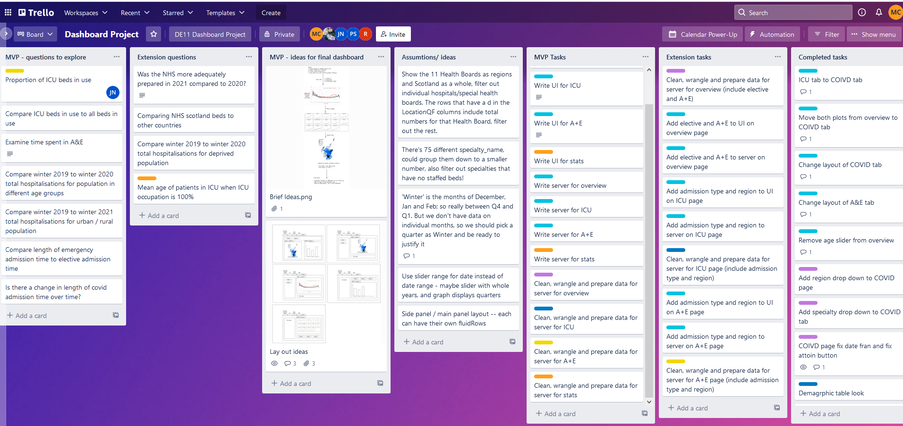
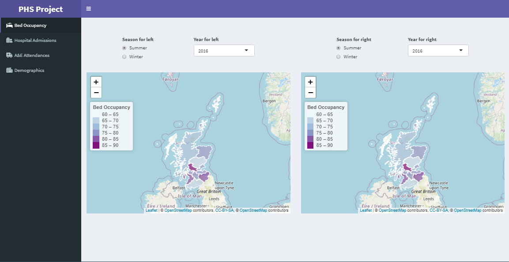
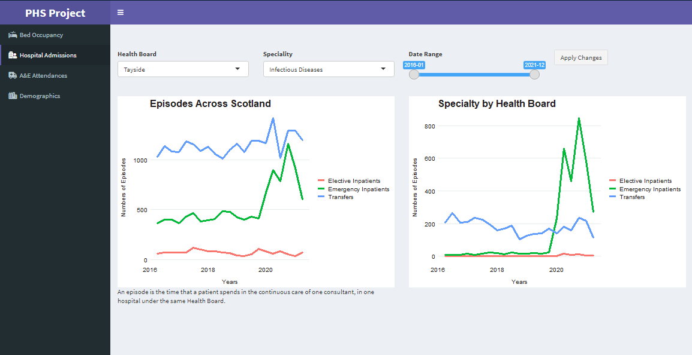
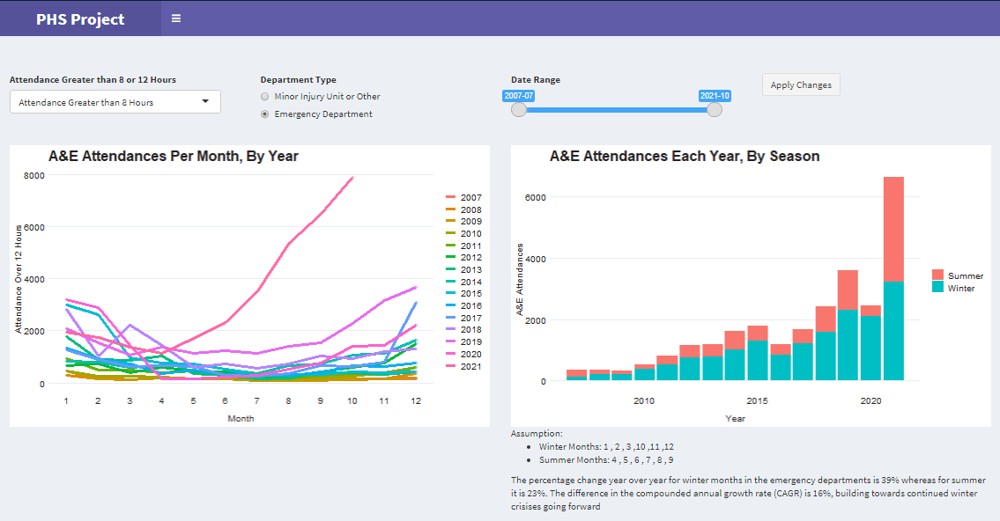
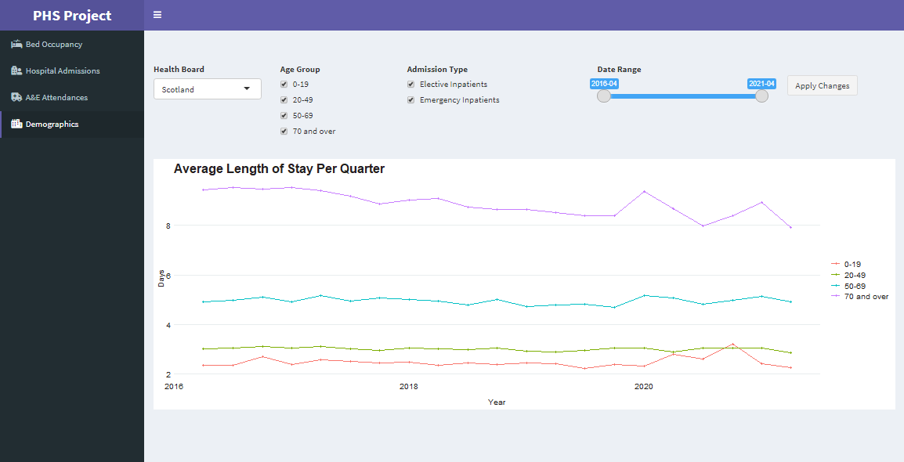

## Introduction

##### _General outline:_  

This project was to create a dashboard using R-Shiny to consider the impact that winter may have on the health care in Scotland using Public Health Scotland data.

The team created a R-Shiny app which allows the user to explore the data we have gathered.

##### _The main points the team were exploring:_  
* To what extent is the ‘winter crisis’ the media predicts real?
* How has winter impacted NHS Scotland’s hospital system in the past?

Data was sourced from Public Health Scotland.

## Team Members

* Malcom Cheyne
* Pui Siu
* Jonny Nelson
* Ricardo Pulido
* Louise Shambrook   
(all from CodeClan DE11 Data Analysis cohort.)

## Roles & responsibilities of each member

**Malcolm worked on:**

* Cleaning, wrangling, and preparing data for the bed occupancy tab
* Implementing plot from DATA to dashboard
* Adding region and specialty drop down to hospital admissions tab
* Linking the date, region, specialty and action buttons with server 

**Pui worked on:**

* Cleaning, wrangling, and preparing data for ICU beds
* Developing the leaflet plots
* Exploring demographics data (cleaning, wrangling and preparing this data)
* Implementing this plot in the demographics tab
* Linking the date, region, age group and action buttons with server

**Jonny worked on:**

 + Cleaning, wrangling, and preparing data for the A&E attendance
 + Implementing plot A and plot B from data to dashboard
 + Linking the date, radio buttons and action buttons with server

**Ricardo worked on:**

 + Developing and maintaining the file and folder structure
 + Exploring and developing the statistics
 + Developing and implementing the leaflet plots
 + Developing the UI and server for the bed occupancy tab
 + Managing implementation of functionalities and merge conflicts

**Louise worked on:**

 + Developing the UI for bed occupancy tab, hospital admissions tab, A&E attendance tab
 + Developing the initial server side for bed occupancy tab, hospital admissions tab, A&E attendance tab
 + Managing oversight of UI, implementation of functionalities and merge conflicts
Overall project management

**The team worked on the:**

* Planning
* Bug fixing
* Presentation
* Understanding KPI and finding insights in the datasets
* Developing the style and theme

## Stages of the project

1. Preliminary data exploration

2. Picking data-sets to focus on and brainstorming ideas

3. Trello planning layout and task delegation 

4. Skeleton for ShinyApp set-up to be filled

5. Cleaning and wrangling the chosen data-sets and importing to ShinyApp

6. Git branching & version control, everyone working on their own branch and later merging with main

7. Adding plots and functionality to the dashboard within the server and ui

## Which tools and packages were used in the project

* Zoom - The team had daily stand-ups and meetings using

* Git/GitHub - for version control and collaborating together using.

* Trello - The team planned and set tasks using 

* Slack - used for communication outside Zoom meetings

* RStudio - The packages used in this project are as follows:
  + shiny
  + shinyWidgets
  + janitor
  + tidyverse
  + leaflet
  + infer
  + shinydashboard
  + sf
  + rgdal
  + lubridate
  + rmapshaper
  
## How did you gather and synthesise requirements for the project?

* We synthesized the information given in the brief by assigning certain people
to look at data-sets and find specific KPI's we could focus on in the ShinyApp.
These KPI's then formed the tabs in the ShinyApp, which were further broken down 
by specific filters. We were able to use ggplot to show time series, filters to break
down demographics and leaflet to show geospatial data.

* We prioritised "bed occupancy rates", "hospital admissions", "A&E attendances" and  "demographics"

## Motivations for using the data you have chosen

* **Bed occupancy rates** was used be able to determine the difference
between the summer and winter occupancy rates per health board in a leaflet plot.
Bed occupancy rates are often talked about in the media and in relation to COVID and
the winter crises that NHS hospitals face

* **Hospital admissions** was used as it clearly breaks down the admissions 
by specialty. We are able to see if there was a rise in infectious disease admissions
which will reflect the COVID and winter crises. 

* **A&E attendances** was chosen to answer the question, are there rises in attendances around 
the winter months as opposed to the summer months. The data could further be effectively broken
down to reflect each year and therefore show post-COVID affects and seasonality.

* **Demographics** were chosen as this data-set was needed to answer the final of the three
different aspects we needed to look at aside from temporal and geographic. We are able 
to see which age groups are most affected in comparison to one another. 

## Data quality and potential bias, including a brief summary of data cleaning and transformations

* The Data is taken from PHS open data, which is a National Statistics Publication therby
meaning this publication must meet the "highest standards of trustworthiness, quality and public value. The  publication fully complies with the Code of Practice for Official Statistics"

* The datasets not likely to be biased because as "This publication has been assigned a low risk of data quality concerns." 

* Not much cleaning of the datasets was required as PHS data is already clean and in the standard tidy and long format, appropriate for analysis.

* The data was wrangled in various ways:
  + years, quarters and months were mutated from the date provided
  + a winter flag was mutated in to assign the observations as lying in winter or summer months
  + health board was mutated to give the name of the health board instead of a code provided.

_Reference_ - https://www.publichealthscotland.scot/publications/acute-hospital-activity-and-nhs-beds-information-quarterly/acute-hospital-activity-and-nhs-beds-information-quarterly-quarter-ending-31-december-2019/data-quality/ 
  
## How is the data stored and structued

* The data is in the form of linked data. This means that the structure of the database is contained within the data.

* Any data point in a linked dataset should have a unique identifier which is a URL.

* Benefits of storing the data like this, are that the data points can be browsed using a web
browser and can be referenced to other link datasets.

## Ethical and legal considerations of the data

**Ethical considerations**

* There few ethical considerations, as the data is fully anonymous, respecting patient privacy.

* A niche case whereby ethical considerations should be made, is if life insurance companies operating in Scotland use this data to skew their policies and target certain demographics in particular regions.

* Security of the data is not an issue, as all PHS data is open. Anyone can access the datasets.

* The data perhaps does not respect patients adequate consent to take anonymous data in the first place. However, people can register a "National Data Opt-out" to prevent NHS Digital from
sharing your identifiable patient data. 

**Legal considerations**

* The datasets are covered by the Open Government License, which means we can copy, publish, adapt and transmit the information. We are also able to use this data commercially and non-commercially. However, we must acknowledge the source of the information.

_License reference_ https://www.nationalarchives.gov.uk/doc/open-government-licence/version/3/ 

## Screenshots
### Bed Occupancy

### Hospital Admissions

### A & E Admissions

### Demographics

## References

The data used were all sourced from https://www.opendata.nhs.scot/. The links below are all the specific links to each dataset used:

https://www.opendata.nhs.scot/dataset/hospital-beds-information - Beds by Specialty
https://www.opendata.nhs.scot/dataset/inpatient-and-daycase-activity/resource/00c00ecc-b533-426e-a433-42d79bdea5d4 - Length of stays
https://www.opendata.nhs.scot/dataset/inpatient-and-daycase-activity/resource/c3b4be64-5fb4-4a2f-af41-b0012f0a276a - Hospital admissions by Specialty
https://www.spatialdata.gov.scot/geonetwork/srv/api/records/f12c3826-4b4b-40e6-bf4f-77b9ed01dc14 - Shape file used to plot health board regions
